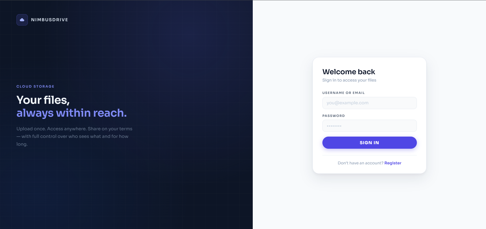
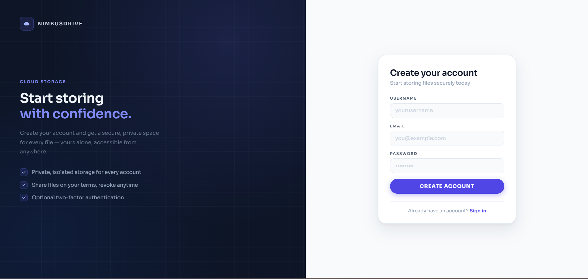
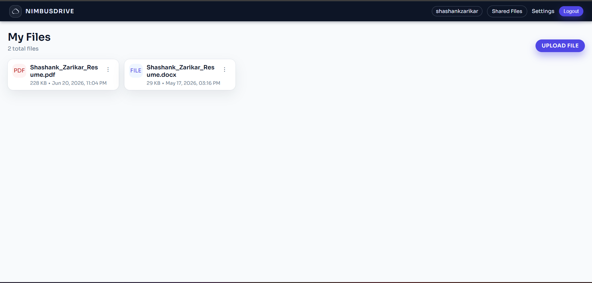
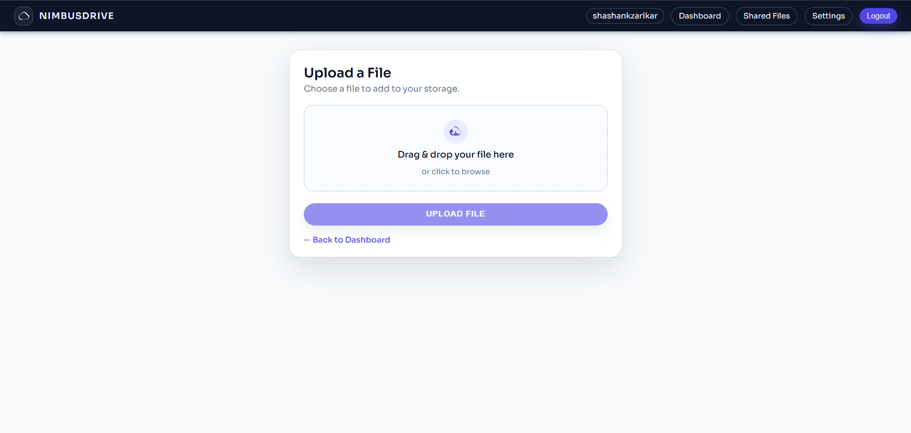
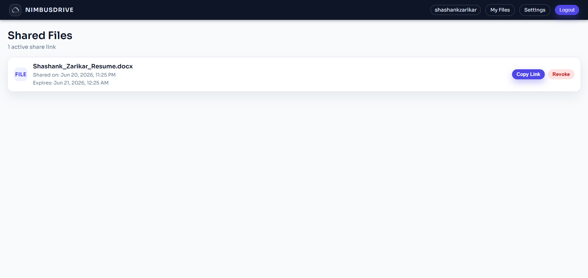
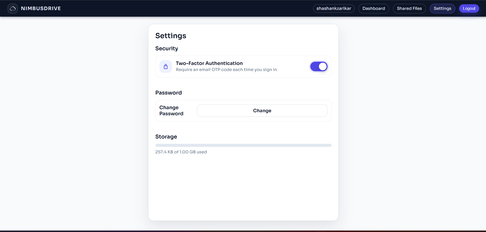

# NimbusDrive

> A production-grade cloud storage application built from scratch — secure file upload, sharing, two-factor authentication, and storage quota enforcement, deployed live on Render with Aivon.io for database.


**Live demo:** [nimbusdrive.com](https://nimbusdrive-5377.onrender.com/login.html) &nbsp;|&nbsp; **GitHub:** [github.com/shashankzarikar/NimbusDrive](https://github.com/shashankzarikar/NimbusDrive)

---

## Features

### JWT Authentication
Stateless authentication using JWT — no server-side sessions. Login accepts either username or email. Passwords are hashed with BCrypt on registration and compared on login using `BCryptPasswordEncoder.matches()` — the original password is never stored or recoverable even if the database is compromised. All login failures return the same generic `"Invalid credentials!"` message regardless of whether the username or password was wrong — prevents username enumeration attacks where an attacker probes which accounts exist.

### File Operations
Users can upload, download, inline preview, and delete files. Files are stored on AWS S3 with metadata (filename, MIME type, size, owner, upload time) in MySQL. Upload enforces a MIME type whitelist and a 10 MB size limit — both checked before the S3 call so a rejected upload never reaches AWS. S3 delete runs before DB delete — if the DB operation fails after S3 succeeds, the file record still exists and the operation can be retried. The worse outcome in the other order (orphaned S3 bytes with no DB record) is unrecoverable.

Inline preview opens PDFs, images, and plain text directly in the browser tab without downloading. `window.open()` cannot be used for this because it is a plain browser navigation request that cannot carry the `Authorization: Bearer` header — the server returns 401. The solution is to `fetch()` the bytes with the JWT header, create a temporary Blob URL via `window.URL.createObjectURL()`, then open that. The Blob URL is revoked after 10 seconds to prevent memory leaks.

Two separate endpoints exist for preview and download — `GET /api/files/preview/{id}` returns `Content-Disposition: inline`, `GET /api/files/download/{id}` returns `Content-Disposition: attachment`. They cannot be merged into one because the Download button must always force a file save to disk.

### File Sharing
Any file can be shared via a unique UUID token — no NimbusDrive account required to view. The actual S3 key is never exposed to the viewer. Share links support optional expiry (1h / 24h / 7d / 30d / never) stored as an absolute timestamp — every validation is a single `expiresAt.isBefore(LocalDateTime.now())` comparison. Links can be revoked instantly by the owner at any time.

Revocation sets `is_active = false` rather than deleting the row — the link dies immediately but the record stays for history. One active link per file is enforced in the service layer: `findByFileAndIsActiveTrue()` is called before creation and returns 409 CONFLICT if an active link already exists. A database UNIQUE constraint cannot be used here because revoked rows must coexist with the same `file_id`.

Expired and revoked links return HTTP 410 Gone — not 403 Forbidden. 403 implies the viewer could gain access with different credentials. 410 means the resource is permanently gone and no action will change that.

### Two-Factor Authentication
After password login, users with 2FA enabled receive a 6-digit OTP via email. The OTP is generated using Java's `SecureRandom` — seeded from OS-level entropy, cryptographically unpredictable. `Math.random()` uses a predictable pseudorandom algorithm and is never appropriate for security-sensitive values. `SecureRandom` is declared `private static final` at class level — one instance for the entire application lifetime, not re-instantiated on every OTP request.

The OTP is stored in the database with a 10-minute expiry (absolute timestamp) and an `isUsed` flag. On verification, three conditions must pass: the code exists, `isUsed` is false, and the current time is before `expiresAt`. After successful verification, `isUsed` is set to true — the row is kept for audit trail, not deleted. `@Transactional` is required on `generateAndSendOtp()` because Spring Data JPA's derived delete methods require an active transaction to execute — without it, the second OTP request fails with a JPA error.

The OTP modal appears inline on the login page — no separate `/verify-otp.html` page. A separate page would require passing the username across navigation via localStorage or a URL parameter, both fragile. The inline modal keeps the username in memory on the same page with no full reload.

Per-user on/off toggle in Settings with a two-step enable flow — password confirmation first, then OTP verification before 2FA is activated.

### Storage Quota
Every user has a 1 GB storage limit tracked in `storage_used` and `storage_limit` columns on the users table. On every upload, the quota check runs before the S3 call — a rejected upload never reaches AWS and incurs no bandwidth cost. After a successful upload, `storageUsed` is incremented. On delete, it is decremented using `Math.max(0, storageUsed - fileSize)` — floors at zero to handle files uploaded before quota tracking was introduced, preventing a negative `storageUsed` value.

The Settings page shows a live progress bar: blue for normal usage, amber above 75%, red above 90%.

### Change Password
Password change requires the current password to be confirmed before the new one is accepted — prevents silent account takeover if someone accesses an unlocked screen.

### Pagination
All file list responses are paginated via Spring Data's `Pageable`. `GET /api/files` accepts `?page=0&size=10` query parameters. The repository automatically applies `LIMIT` and `OFFSET` to the SQL query. The response includes `currentPage`, `totalPages`, and `totalFiles` metadata. The dashboard shows Previous/Next navigation with disabled states at boundaries.

### Input Validation & Error Handling
All request DTOs use Jakarta Bean Validation — `@NotBlank`, `@Email`, `@Size` on every field. Validation errors are caught by `GlobalExceptionHandler` (`@RestControllerAdvice`) before reaching any service layer. Every error across the entire application — validation failures, ownership violations, expired share links, quota exceeded — returns the same consistent format: `{ "success": false, "message": "..." }`. No stack traces are ever returned to the client.

### Multi-User Isolation
Every file operation — download, preview, delete, share — calls `FileService.getFileEntity()` which checks that the logged-in username matches the file's `uploadedBy` field. A valid JWT from another user cannot access your files — returns 403 FORBIDDEN. Verified with Postman across multiple accounts.

---

## Screenshots

### Authentication

<table>
<tr>
<td width="50%"></td>
<td width="50%"></td>
</tr>
<tr>
<td align="center"><sub>Login — split-panel design with inline 2FA OTP flow</sub></td>
<td align="center"><sub>Register — account creation with live validation</sub></td>
</tr>
</table>

### Dashboard



File grid with inline preview, kebab menu (download / share / delete), and pagination.

### Uploading a File



Drag-and-drop or click-to-browse upload with live file size and type feedback.

### File Sharing


Generate a public, revocable share link with configurable expiry directly from the dashboard.



A dedicated page to track, copy, and revoke every active share link in one place.

### Settings — Security & Storage



Two-Factor Authentication toggle, password change, and a live storage quota bar with amber/red thresholds.

---

## Architecture

```
┌─────────────────────────────────────────────────────────────┐
│                        Browser                              │
│   login.html  register.html  dashboard.html  settings.html  │
│         share.html (public)   shared.html   upload.html     │
└──────────────────────┬──────────────────────────────────────┘
                       │ HTTPS — fetch() + JWT Bearer token
                       ▼
┌─────────────────────────────────────────────────────────────┐
│                  Spring Boot Application                    │
│                                                             │
│  JwtAuthFilter ──► SecurityConfig                           │
│                                                             │
│  AuthController       FileController     UserSettings       │
│  FileShareController  PublicShareController                 │
│          │                   │                              │
│          ▼                   ▼                              │
│  AuthService         FileService ◄──── FileShareService     │
│  TwoFactorService    UserService                            │
│          │                   │                              │
│          ▼                   ▼                              │
│  UserRepository      FileRepository   FileShareRepository   │
│  OtpTokenRepository                                         │
└──────┬───────────────────────┬─────────────────────────────┘
       │                       │
       ▼                       ▼
┌─────────────┐      ┌──────────────────┐
│  MySQL 8.0  │      │    AWS S3        │
│             │      │  ap-south-1      │
│             │      │  Mumbai region   │
│  users      │      │                  │
│  files      │      │  username/       │
│  file_shares│      │  uuid_filename   │
│  otp_tokens │      │                  │
└─────────────┘      └──────────────────┘
```

**Request flow for a file upload:**
1. Browser sends `POST /api/files/upload` with `Authorization: Bearer <token>`
2. `JwtAuthFilter` validates the token — rejects with 401 if invalid
3. `FileController` receives the request, calls `FileService`
4. `FileService` validates MIME type and size, checks storage quota — rejects with 400 if exceeded
5. `S3Service` uploads to AWS S3
6. `FileRepository` saves metadata to MySQL, `storageUsed` incremented on the `User` record

---

## Tech Stack

| Layer | Technology |
|---|---|
| Language | Java 23 |
| Framework | Spring Boot 4.0.3 |
| Security | Spring Security 7.0.3 + jjwt 0.12.3 |
| Validation | Jakarta Bean Validation |
| Database | MySQL 8.0 (Aivon.io cloud for production) |
| ORM | Hibernate 7.2.4 / JPA |
| Cloud Storage | AWS S3 — ap-south-1 (Mumbai) |
| AWS SDK | software.amazon.awssdk 2.25.6 |
| Password Hashing | BCrypt |
| Build Tool | Maven |
| Frontend | HTML + CSS + Vanilla JS |
| Email | Brevo HTTP API (POST to api.brevo.com/v3/smtp/email) |
| Deployment | Render |

---

## Security Model

```
Layer 1 — Spring Security + JWT Filter  [server-enforced]
  └── JwtAuthFilter intercepts every API request
  └── Requests without a valid JWT are rejected at filter level
  └── Runs before any controller code executes

Layer 2 — File Ownership Check  [server-enforced]
  └── FileService.getFileEntity() verifies logged-in username
      matches file.uploadedBy on every download, preview, delete
  └── Returns 403 FORBIDDEN if they do not match
  └── A valid JWT from another user cannot access your files
```

> **Note:** The frontend checks `localStorage` for a JWT on page load as a UX convenience — redirecting unauthenticated users to login. This is not a security layer and can be bypassed entirely. All real security is enforced server-side by the two layers above.

**Additional security measures:**
- BCrypt one-way password hashing — original password unrecoverable even if DB is compromised
- Generic `"Invalid credentials!"` for all login failures — prevents username enumeration attacks
- Zero secrets hardcoded — all credentials in environment variables with `NIMBUSDRIVE_` prefix
- Dedicated IAM user (`nimbusdrive-s3-user`) with S3 permissions only — principle of least privilege
- Dedicated MySQL user — not root
- DTO pattern on all API responses — JPA entities never serialized directly
- File type MIME whitelist — enforced on backend, frontend check is UX only
- HTTP 410 Gone for expired/revoked share links — semantically correct, signals no action is possible

---

## API Reference

| Method | Endpoint | Auth | Description |
|---|---|---|---|
| POST | `/api/auth/register` | Public | Register new user |
| POST | `/api/auth/login` | Public | Login — returns JWT or `requires2FA: true` |
| POST | `/api/auth/verify-otp` | Public | Verify OTP and issue JWT after 2FA login |
| POST | `/api/files/upload` | JWT | Upload file — validates type, size, quota before S3 |
| GET | `/api/files?page=0&size=10` | JWT | List files — paginated |
| GET | `/api/files/download/{id}` | JWT | Download file from S3 — forced attachment |
| GET | `/api/files/preview/{id}` | JWT | Preview file inline — PDF, images, plain text |
| DELETE | `/api/files/{id}` | JWT | Delete from S3 and MySQL, decrements quota |
| POST | `/api/files/{id}/share` | JWT | Create share link with expiry |
| GET | `/api/files/{id}/share` | JWT | Get active share link for a file |
| DELETE | `/api/files/{id}/share` | JWT | Revoke share link |
| GET | `/api/files/shared` | JWT | List all active share links |
| GET | `/api/share/{token}/info` | Public | Get file info for public viewer — no JWT |
| GET | `/api/share/{token}/preview` | Public | Serve file inline to viewer |
| GET | `/api/share/{token}/download` | Public | Serve file as download to viewer |
| GET | `/api/user/2fa/status` | JWT | Get 2FA enabled status |
| POST | `/api/user/2fa/enable` | JWT | Enable 2FA — two-step: password then OTP |
| POST | `/api/user/2fa/disable` | JWT | Disable 2FA with password confirmation |
| GET | `/api/user/storage` | JWT | Get storage used and limit |
| POST | `/api/user/change-password` | JWT | Change password with current password confirmation |

All error responses follow a consistent format:
```json
{ "success": false, "message": "Descriptive error message" }
```

---

## Database Schema

Tables are auto-created by Hibernate (`ddl-auto=update`) on first startup.

### users
| Column | Type | Notes |
|---|---|---|
| id | BIGINT | Primary key, auto-increment |
| username | VARCHAR | Unique, not null |
| email | VARCHAR | Unique, not null |
| password | VARCHAR | BCrypt hashed, never plain text |
| role | ENUM | `USER` or `ADMIN`, stored as string |
| storage_limit | BIGINT | Default 1073741824 (1 GB in bytes) |
| storage_used | BIGINT | Default 0 |
| is_2fa_enabled | BOOLEAN | Default false |
| is_active | BOOLEAN | Default true |
| created_at | DATETIME | Set on creation |

### files
| Column | Type | Notes |
|---|---|---|
| id | BIGINT | Primary key, auto-increment |
| file_name | VARCHAR | Original filename |
| s3_key | VARCHAR | Full S3 path — `username/uuid_filename` |
| file_type | VARCHAR | MIME type |
| file_size | BIGINT | Size in bytes |
| uploaded_by | BIGINT | Foreign key → users.id, not null |
| uploaded_at | DATETIME | Set on upload |
| is_public | BOOLEAN | Default false |

### file_shares
| Column | Type | Notes |
|---|---|---|
| id | BIGINT | Primary key, auto-increment |
| file_id | BIGINT | Foreign key → files.id |
| created_by | BIGINT | Foreign key → users.id |
| share_token | VARCHAR(36) | UUID v4, unique — the public identifier |
| created_at | DATETIME | Set on creation |
| expires_at | DATETIME | Nullable — null means never expires |
| is_active | BOOLEAN | Default true — set to false on revoke, row kept for history |

### otp_tokens
| Column | Type | Notes |
|---|---|---|
| id | BIGINT | Primary key, auto-increment |
| user_id | BIGINT | Foreign key → users.id |
| otp_code | VARCHAR(6) | 6-digit code generated via SecureRandom |
| created_at | DATETIME | Set on creation |
| expires_at | DATETIME | 10 minutes after creation |
| is_used | BOOLEAN | Default false — marked true after verification, row kept for audit |

---

## Project Structure

```
com.nimbusdrive
├── config
│   ├── SecurityConfig.java          ← Spring Security rules + JWT filter setup
│   └── S3Config.java                ← AWS S3 client bean
├── controller
│   ├── AuthController.java          ← Register, Login, Verify OTP
│   ├── FileController.java          ← Upload, List, Download, Preview, Delete
│   ├── FileShareController.java     ← Share create, get, revoke, list (JWT)
│   ├── PublicShareController.java   ← Public share info, preview, download (no JWT)
│   └── UserSettingsController.java  ← 2FA, storage, change password
├── dto
│   ├── RegisterRequest.java         ← Registration input
│   ├── LoginRequest.java            ← Login input
│   ├── LoginResponse.java           ← token + requires2FA + message
│   ├── FileResponse.java            ← API output — no internal fields exposed
│   ├── FileDownloadResult.java      ← fileName + contentType + bytes
│   ├── FilePageResponse.java        ← Paginated file list + metadata
│   ├── FileShareResponse.java       ← Owner-facing share link info
│   ├── ShareInfoResponse.java       ← Public viewer info — no s3Key, no fileId
│   └── StorageResponse.java         ← storageUsed + storageLimit
├── exception
│   └── GlobalExceptionHandler.java  ← @RestControllerAdvice — all errors
├── filter
│   └── JwtAuthFilter.java           ← Validates JWT on every request
├── model
│   ├── User.java
│   ├── FileEntity.java              ← ManyToOne → User
│   ├── FileShare.java               ← ManyToOne → FileEntity, User
│   └── OtpToken.java                ← ManyToOne → User
├── repository
│   ├── UserRepository.java
│   ├── FileRepository.java
│   ├── FileShareRepository.java
│   └── OtpTokenRepository.java
├── service
│   ├── AuthService.java             ← Register + Login
│   ├── FileService.java             ← Coordinates S3Service + FileRepository
│   ├── FileShareService.java        ← Share create, revoke, validate, serve
│   ├── TwoFactorService.java        ← OTP generate, verify, enable, disable
│   ├── EmailService.java            ← Brevo HTTP API — sends OTP emails via HTTP POST
│   ├── UserService.java             ← Storage info
│   └── S3Service.java               ← Direct AWS S3 operations
└── util
    └── JwtUtil.java                 ← Generate, validate, extract JWT

src/main/resources/static/
├── login.html       ← JWT login + inline OTP modal for 2FA
├── register.html    ← User registration
├── dashboard.html   ← File list, kebab menu, share modal, pagination
├── upload.html      ← Drag & drop file upload
├── share.html       ← Public share viewer — no login required
├── shared.html      ← Active share links — copy and revoke
└── settings.html    ← 2FA toggle, storage quota bar, change password
```

---

## Running Locally

**Prerequisites:** Java, Maven, MySQL 8.0, AWS account with S3 bucket, Brevo account

**1. Set environment variables**

```bash
DATABASE_URL                  = jdbc:mysql://localhost:3306/nimbusdrive
NIMBUSDRIVE_DB_USERNAME       = your_mysql_username
NIMBUSDRIVE_DB_PASSWORD       = your_mysql_password
NIMBUSDRIVE_JWT_SECRET_KEY    = your_jwt_secret_min_32_chars
NIMBUSDRIVE_AWS_ACCESS_KEY    = your_aws_access_key
NIMBUSDRIVE_AWS_SECRET_KEY    = your_aws_secret_key
NIMBUSDRIVE_AWS_BUCKET        = your_s3_bucket_name
NIMBUSDRIVE_AWS_REGION        = ap-south-1
NIMBUSDRIVE_MAIL_USERNAME     = your_verified_sender_email
NIMBUSDRIVE_BREVO_API_KEY     = your_brevo_api_key
```

**2. Create the database**

```sql
CREATE DATABASE nimbusdrive;
```

**3. Run**

```bash
cd nimbusdrive
mvn spring-boot:run
```

**4. Open** `http://localhost:8080/login.html`

> Hibernate will auto-create all tables on first startup via `ddl-auto=update`.

---

## Known Limitations

| Limitation | Current Behavior | Better Approach |
|---|---|---|
| JWT in localStorage | Vulnerable to XSS | HttpOnly cookies |
| Registration enumeration | Specific messages on register | Email confirmation flow |
| Backend streams file bytes | App server is bottleneck at scale | S3 presigned URLs |
| No rate limiting on login | Brute force possible | Spring Rate Limiter |
| No refresh token | JWT expiry not handled gracefully | Access + refresh token pair |
| `ddl-auto=update` in production | Risky for schema changes | Flyway migrations |
| No logging | No visibility into system behavior | SLF4J + structured logs |
| Single file upload only | One file at a time | Multi-file upload with progress per file |

---

## Future Roadmap

- [ ] Zero Knowledge Encryption — AES-256-GCM, client-side key derivation (PBKDF2), Web Crypto API
- [ ] Multi-file upload
- [ ] Infinite scroll on dashboard (replacing pagination)
- [ ] File versioning — max 10 versions per file, restore capability
- [ ] Admin panel
- [ ] S3 presigned URLs — direct client-to-S3 upload

---
